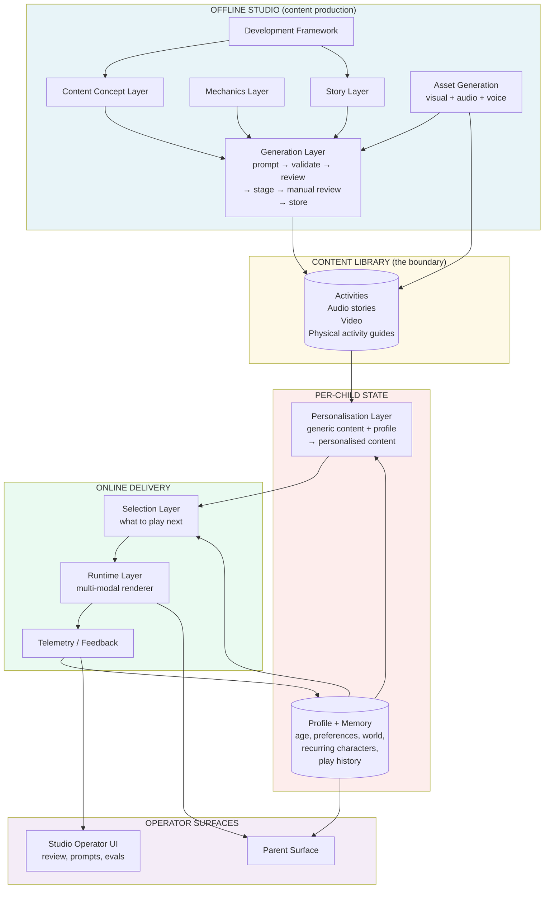
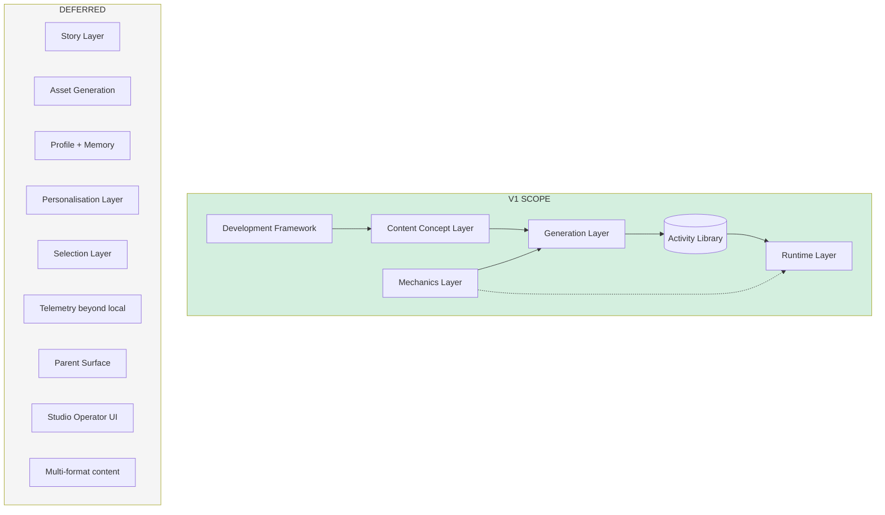
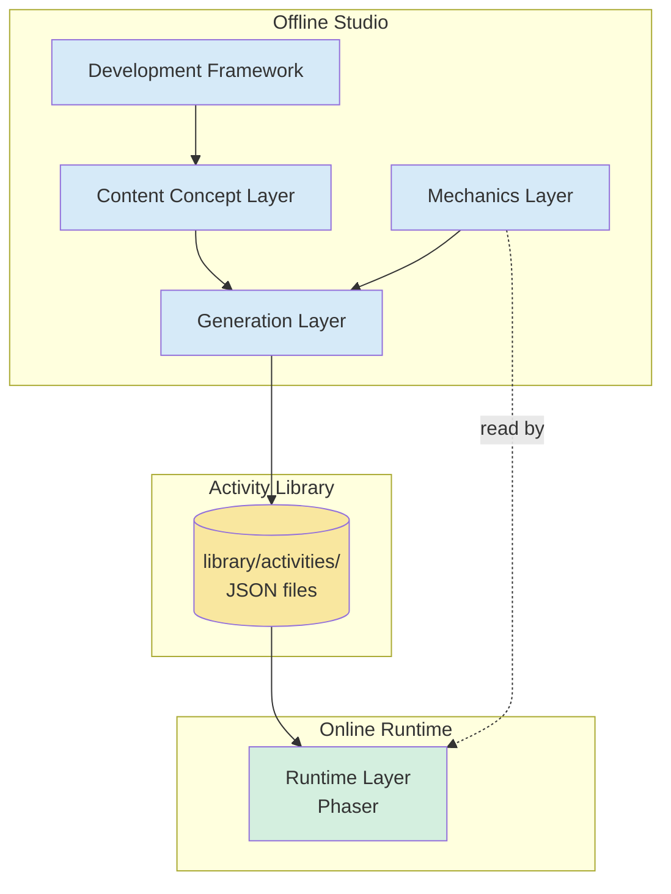
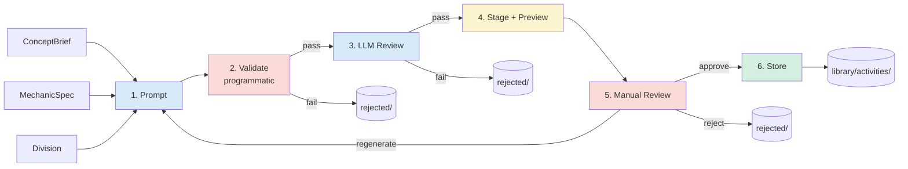
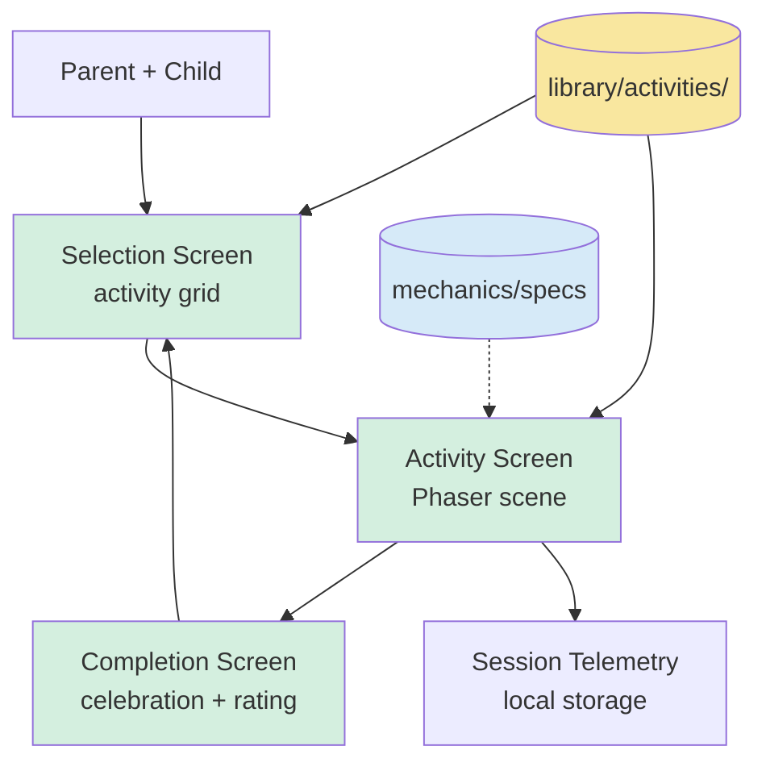

# Bloom V1 — Architecture (HLD)

This document captures the high-level architecture for Bloom V1. It defines the layers, their responsibilities, the contracts between them, and the key technical decisions. Implementation details — specific TypeScript interfaces, test strategy, file-by-file specs, build order — live in `IMPLEMENTATION.md`, not here.

This document is the persistent contract. It changes rarely. The implementation plan changes often.

## End-state architecture

Before describing V1, here is the steady-state architecture Bloom is being built towards. V1 is a deliberate subset of this — the portions that prove the foundational claims of the system.



**What this picture says:**

- The studio produces generic content. Lots of it. Across formats. Reviewed by humans before it ships.
- The library is the boundary. Everything past it is per-child and online.
- Personalisation transforms generic content into child-specific content. This is the moat — the thing competitors will struggle to replicate.
- Selection picks what to play. Runtime delivers it. Telemetry feeds back into profile and into eval systems for the studio.
- Operator surfaces (for parents, for the internal studio team) are real components, not afterthoughts.

**What V1 builds, marked on the picture:**



**V1 is the spine.** Studio production → library → runtime. Single age band, single content format, single child. No personalisation, no selection, no story. The smallest possible system that proves the architecture works end-to-end and produces content a real child enjoys.

Everything deferred is real future work, not vague gestures. Each deferred component has a known place in the end-state picture — the V1 layers are shaped to receive them when their time comes.

## V1 system overview

V1 is a **studio-style content production system** plus a **runtime** that delivers the produced content to a child.

The studio side is offline — it produces, validates, reviews, and stores activities ahead of time. The runtime side is online — it serves activities to the child with no LLM calls in the hot path.

Five layers. Two zones (offline studio / online runtime). One handoff between them: the activity library.



The library is the boundary. Studio writes to it; runtime reads from it. They share nothing else at runtime.

## Layer responsibilities

### Development Framework

**What it is:** The science backbone. Defines domains, divisions (granular skills), and milestones for each age band.

**What it owns:** The data file(s) and the query interface to them.

**What it does not own:** Anything about activities, mechanics, or rendering. It is content-pure.

**Handshake:** Exposes lookups by age and by ID. Returns Division objects to callers.

### Content Concept Layer

**What it is:** The brief generator. Produces concept briefs that tell the Generation Layer what to make.

**What it owns:** The shape of a ConceptBrief, the authoring tool that produces them, the storage of authored briefs.

**What it does not own:** How concepts get turned into activities. That's Generation's job.

**Handshake:** Reads from the Framework. Produces ConceptBriefs that reference division IDs.

### Mechanics Layer

**What it is:** The script library. Each mechanic spec defines what content slots it needs, what parameters tune its difficulty, and what the runtime expects to render.

**What it owns:** Mechanic specs (data) and the lookup interface.

**What it does not own:** Mechanic *implementation* (rendering logic). That lives in the Runtime Layer. The spec is the contract; the runtime is the executor.

**Handshake:** Read by both Generation (to know what to generate) and Runtime (to know how to render and validate). This is the only layer with two consumers.

### Generation Layer

**What it is:** The factory. Takes a concept brief and a mechanic spec, produces a validated, reviewed activity.

**What it owns:** The generation pipeline (six sub-stages — see below), prompts, the eval set, the staging area, the manual review surface, and final storage.

**What it does not own:** Where activities are consumed (runtime). It produces and stores; runtime takes it from there.

**Handshake:** Reads ConceptBriefs and MechanicSpecs. Produces ActivityJSONs in the library.

### Runtime Layer

**What it is:** The delivery system. Loads activities from the library and presents them to the child.

**What it owns:** The Phaser app, the screens (Selection, Activity, Completion), the asset loading, the input handling, the session telemetry capture.

**What it does not own:** Any content production. The runtime is dumb — it renders whatever the library tells it to.

**Handshake:** Reads ActivityJSONs from the library. Reads MechanicSpecs to know how to render. Writes session records to local storage.

## Generation pipeline

The Generation Layer is the most complex. It has six sub-stages, with both automated and human gates.



**Key properties:**

- **Validate is programmatic and fast.** Schema check, asset reference resolution, parameter bounds. No LLM call. Catches structural failures cheaply.
- **LLM Review is a separate Claude call.** Different prompt, different responsibility. Catches semantic failures. Returns a score and structured notes.
- **Stage produces a manual-review surface.** A static HTML page combining: visual preview (rendered items + targets + audio playback), full Activity JSON inline, and the LLM reviewer's notes. Independent of the Phaser runtime. Three views, one page — visual issues caught by the preview, source-of-error caught by the JSON, reviewer disagreement traceable via the notes.
- **Manual Review is a human step.** Approve, reject, or regenerate. Rejections feed the eval set as new test cases.
- **Store moves staged → library/activities/.** Only after manual approval.

Rejections at any stage are persisted with their failure reason. This is the data that grows the eval set and improves the LLM reviewer over time.

### Eval strategy

Three eval levels, all run before any prompt change is committed:

- **Schema-level:** does the output validate against the activity schema?
- **Content-level:** does the LLM review pass?
- **Mechanic-level:** does the activity actually render in the runtime without errors? (Integration test — requires runtime.)

V1 starts with ~10 hand-authored test cases. The set grows from production rejections.

## Runtime architecture



**Three screens:**

- **Selection screen** — categorised activity grid. Parent picks. (V1's substitute for the Selection Layer.)
- **Activity screen** — Phaser scene. Loads activity JSON, renders the mechanic with filled slots, handles drag/tap interactions, plays audio, shows feedback.
- **Completion screen** — celebration animation + parent rating prompt.

**Key technical properties:**

- **Zero LLM calls in the hot path.** Activities are pre-generated. The runtime never waits on a model.
- **Phaser handles input through its own event system.** This bypasses the DOM event loop that caused drag-vs-scroll conflicts in the prior HTML prototype.
- **Audio is bundled with the activity JSON as file references.** No real-time TTS. Audio files served as static assets.
- **Session telemetry is captured but minimal.** What activity, when, completed/abandoned, time-to-complete, parent rating. Stored locally for V1; will sync to backend in later versions.

## Layer-to-layer contracts (HLD)

These are the conceptual contracts. Full TypeScript interfaces live in `IMPLEMENTATION.md`.

```
Framework         → exposes:  getDivisionsForAge, getDivisionById
                    consumed by: Concept Layer, Generation Layer

Concept Layer     → exposes:  getConceptBrief, listConceptBriefs
                    consumed by: Generation Layer

Mechanics Layer   → exposes:  getMechanicSpec, listMechanicSpecs
                    consumed by: Generation Layer (read for slot/param schemas),
                                 Runtime Layer (read for render contracts)

Generation Layer  → exposes:  generateActivity (offline only)
                    produces: ActivityJSON files in library/

Runtime Layer     → exposes:  N/A (terminal consumer)
                    consumes: ActivityJSON, MechanicSpec
                    produces: SessionRecord in local storage
```

**One consumer rule:** every layer except Mechanics has exactly one consumer. Mechanics has two (Generation and Runtime), which is intentional — the spec is the shared contract that ensures Generation produces what Runtime can render.

## Repository structure

The file layout maps directly to the layers. Each directory is a layer or a layer's data store.

```
bloom/
├── framework/                  # Layer 1: Development Framework
│   ├── framework-2-3.yaml     # Age-band data
│   └── loader.ts              # Query interface
│
├── concepts/                   # Layer 2: Content Concept Layer
│   ├── briefs/                # Authored ConceptBriefs (JSON)
│   ├── new-concept.ts         # CLI authoring tool
│   └── loader.ts              # Query interface
│
├── mechanics/                  # Layer 3: Mechanics Layer
│   ├── specs/
│   │   ├── drag-to-target.yaml
│   │   └── tap-to-select.yaml
│   └── loader.ts              # Query interface
│
├── generation/                 # Layer 4: Generation Layer
│   ├── prompts/               # Versioned prompt files
│   │   ├── generate-drag-to-target.v1.txt
│   │   └── review.v1.txt
│   ├── pipeline/
│   │   ├── prompt.ts          # Stage 1: prompt + Claude call
│   │   ├── validate.ts        # Stage 2: programmatic
│   │   ├── llm-review.ts      # Stage 3: LLM review
│   │   ├── stage.ts           # Stage 4: stage + preview generator
│   │   └── store.ts           # Stage 6: write to library
│   ├── review-ui/             # Stage 5: manual review HTML surface
│   ├── evals/                 # Eval cases + runner
│   └── generate-cli.ts        # CLI entry point
│
├── library/                    # Activity Library (the studio↔runtime boundary)
│   ├── activities/            # Approved activities (JSON)
│   ├── staged/                # Awaiting manual review
│   ├── rejected/              # Failed activities + reasons
│   └── assets/                # Sprites, audio
│
├── runtime/                    # Layer 5: Runtime Layer
│   ├── src/
│   │   ├── scenes/
│   │   │   ├── selection.ts
│   │   │   ├── activity.ts
│   │   │   └── completion.ts
│   │   ├── mechanics/         # Mechanic implementations (renders)
│   │   │   ├── drag-to-target.ts
│   │   │   └── tap-to-select.ts
│   │   ├── audio.ts
│   │   ├── telemetry.ts
│   │   └── main.ts
│   ├── public/                # Static assets served to client
│   ├── index.html
│   └── vite.config.ts
│
├── shared/                     # Shared types across layers
│   └── types.ts               # ActivityJSON, ConceptBrief, MechanicSpec, etc.
│
├── CLAUDE.md                   # Instructions for Claude Code
├── VISION.md                   # Long-term product vision
├── PRD.md                      # V1 product requirements
├── ARCHITECTURE.md             # This file
└── IMPLEMENTATION.md           # Build plan, milestones, TDD strategy
```

**Why this layout:**

- One directory per layer. Layer boundaries are also directory boundaries.
- Shared types live in `shared/`. Every layer imports from there for cross-layer contracts.
- The `library/` directory is the explicit handoff point between studio and runtime. It is the *only* path through which content reaches the runtime.
- Prompts are versioned files, not strings in code. This makes prompt iteration trackable in git.

## Key technical decisions

### Renderer: Phaser 3

**Decision:** Phaser 3 for the runtime. Rejected vanilla DOM (broke for Nitara's drag), Pixi (lower-level than needed), native Swift (wrong tool for V1).

**Rationale:** Phaser handles touch input through its own event system (bypassing DOM event-loop issues), has first-class drag-and-drop primitives, proper audio sync via Web Audio API, and a battle-tested scene/sprite/animation model. Standard choice for educational web games.

### Storage: file-based JSON

**Decision:** All persistent data (framework, concepts, mechanics, activities, sessions) stored as JSON/YAML files in the repo for V1.

**Rationale:** One user, one developer, no concurrency concerns. Files are inspectable, version-controlled, and easy to migrate later. A database is V1.5 territory once there are multiple children or remote users.

### Hosting: Vercel

**Decision:** Vercel for the runtime web app. Generation pipeline runs locally (offline studio).

**Rationale:** Zero-config deploy for a Vite-built web app. Free tier sufficient for V1. Easy to add a small backend later if needed.

### TTS: OpenAI TTS HD

**Decision:** OpenAI TTS HD for voice prompt generation.

**Rationale:** Warm voices, single-API integration alongside Anthropic, pennies at V1 volume. Google Cloud TTS WaveNet is the austerity alternative if cost becomes meaningful at scale.

### Visual assets: free icon library

**Decision:** Flaticon or Iconify for V1. AI-generated assets deferred to V1.5.

**Rationale:** Library art is consistent, fast, and removes the AI-image-generation pipeline as a V1 dependency. The interaction quality is the priority for V1; visual style consistency with library art is sufficient.

### Audio assets: free SFX library

**Decision:** Freesound or Mixkit for sound effects. One shared set across all V1 activities.

**Rationale:** Same as visual assets. Consistency across activities is more valuable than variety in V1.

## Build-order dependency

There is one explicit dependency in the build order, captured here so the implementation plan respects it:

**Runtime ← Generation (mechanic-level eval).**

The mechanic-level eval (does an activity actually render?) requires the Runtime Layer to be functional enough to load and render an activity. This means the Runtime cannot be the last thing built — it must exist in some form before the Generation pipeline can be fully tested.

The static preview generator (Stage 4 of the generation pipeline) is independent of the Runtime, so manual review *can* happen before the Runtime exists. But the integration test that validates "this generated activity actually plays" requires the Runtime.

Implementation plan should sequence accordingly.

## What's not in V1

V1's deferred components are visible in the end-state diagram above. Each has a known landing place in the steady-state architecture:

- **Selection Layer** — V1 substitutes a parent-pick grid in the Runtime. End state: a real layer between Personalisation and Runtime that picks per-child, per-moment.
- **Personalisation Layer + Profile/Memory** — V1 has neither. End state: Profile/Memory is the per-child store; Personalisation reads it + a generic activity, produces a personalised activity. This is the moat layer.
- **Story Layer** — V1 has no narrative. End state: feeds into Generation alongside Concept and Mechanic, providing world/character/arc context.
- **Asset Generation** — V1 uses free icon and SFX libraries. End state: a real sub-pipeline producing visually-consistent, brand-controlled assets at scale.
- **Multi-format content** (audio stories, video) — V1 is digital activities only. End state: parallel mechanic/runtime tracks per content type; same studio shape.
- **Operator surfaces** (parent surface, studio operator UI) — V1 has neither beyond CLI. End state: real surfaces for both audiences.
- **Telemetry beyond local** — V1 stores session data locally. End state: telemetry feeds back into Profile (personalisation signal) and into eval systems (content quality signal).

These are explicit non-goals for V1. The V1 layers are shaped so that adding each later does not require restructuring what V1 builds.
